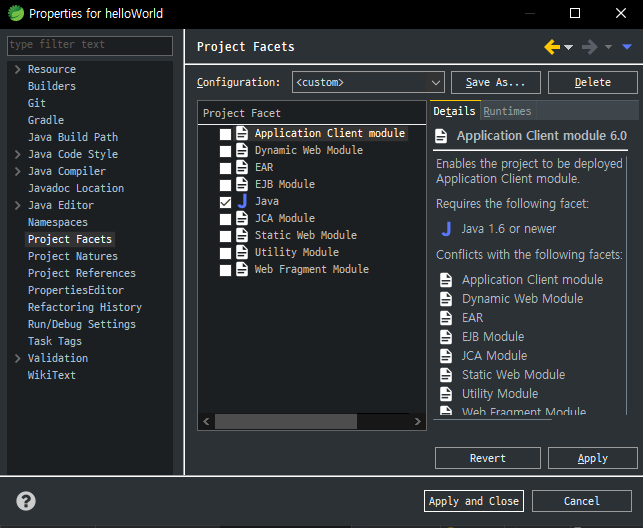
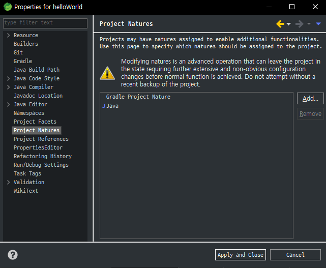
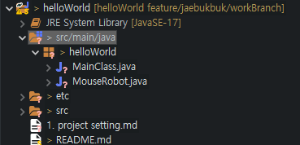

# helloWorld
project setting history

------------------------------------

1. Git 에서 repo 만들기

2. IDE 에서 gti Import 받기

3. 프로젝트 우클릭 -> properties -> Project Facets -> java 추가 

4. 프로젝트 우클릭 -> properties -> project Natures -> java 추가

5. src/main/java 에 package 생성

